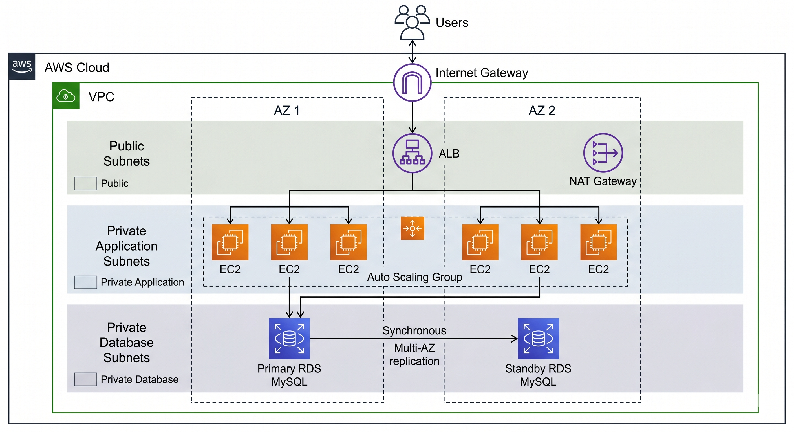

# Project 1: Three-Tier Architecture with Terraform

## 📋 Project Overview

| | |
|---|---|
| **Skill Level** | Intermediate |
| **Description** | In this project, you will deploy a production-ready three-tier web application on AWS using Terraform as Infrastructure as Code (IaC). The architecture includes a Presentation Tier (ALB), Application Tier (EC2 Auto Scaling), and Data Tier (RDS MySQL). |
| **AWS Services Used** | Amazon VPC, Amazon EC2, Auto Scaling, Application Load Balancer, Amazon RDS, Amazon S3, IAM |
| **Tools** | Terraform, AWS CLI, Git |
| **Estimated Time** | 2–3 hours |

## 🏗️ Architecture Diagram



## 🎯 What You'll Learn

- How to design a multi-tier architecture following AWS best practices
- Using Terraform modules for reusable infrastructure code
- Implementing network isolation with public and private subnets
- Configuring Auto Scaling Groups with Launch Templates
- Setting up RDS with Multi-AZ for high availability
- Managing state files with S3 backend

## 📁 Project Structure

```
three-tier-terraform/
├── main.tf
├── variables.tf
├── outputs.tf
├── terraform.tfvars
├── providers.tf
├── modules/
│   ├── vpc/
│   │   ├── main.tf
│   │   ├── variables.tf
│   │   └── outputs.tf
│   ├── alb/
│   │   ├── main.tf
│   │   ├── variables.tf
│   │   └── outputs.tf
│   ├── asg/
│   │   ├── main.tf
│   │   ├── variables.tf
│   │   └── outputs.tf
│   └── rds/
│       ├── main.tf
│       ├── variables.tf
│       └── outputs.tf
├── scripts/
│   └── userdata.sh
└── README.md
```

---

## Steps to Complete the Project

### Step 1: Prerequisites & Initial Setup

1. Install **Terraform** (v1.5+): https://developer.hashicorp.com/terraform/downloads
2. Install and configure **AWS CLI**:
   ```bash
   aws configure
   # Enter your Access Key, Secret Key, Region (us-east-1), Output (json)
   ```
3. Create an S3 bucket for Terraform state:
   ```bash
   aws s3 mb s3://your-name-terraform-state-bucket --region us-east-1
   ```
4. Initialize your project directory:
   ```bash
   mkdir three-tier-terraform && cd three-tier-terraform
   ```

### Step 2: Configure the Terraform Provider & Backend

Create `providers.tf`:

```hcl
terraform {
  required_version = ">= 1.5.0"

  required_providers {
    aws = {
      source  = "hashicorp/aws"
      version = "~> 5.0"
    }
  }

  backend "s3" {
    bucket = "your-name-terraform-state-bucket"
    key    = "three-tier/terraform.tfstate"
    region = "us-east-1"
  }
}

provider "aws" {
  region = var.aws_region
}
```

### Step 3: Define Variables

Create `variables.tf`:

```hcl
variable "aws_region" {
  description = "AWS region to deploy resources"
  type        = string
  default     = "us-east-1"
}

variable "project_name" {
  description = "Project name used for resource naming"
  type        = string
  default     = "three-tier-app"
}

variable "vpc_cidr" {
  description = "CIDR block for the VPC"
  type        = string
  default     = "10.0.0.0/16"
}

variable "public_subnet_cidrs" {
  description = "CIDR blocks for public subnets"
  type        = list(string)
  default     = ["10.0.1.0/24", "10.0.2.0/24"]
}

variable "private_app_subnet_cidrs" {
  description = "CIDR blocks for private application subnets"
  type        = list(string)
  default     = ["10.0.10.0/24", "10.0.20.0/24"]
}

variable "private_db_subnet_cidrs" {
  description = "CIDR blocks for private database subnets"
  type        = list(string)
  default     = ["10.0.100.0/24", "10.0.200.0/24"]
}

variable "instance_type" {
  description = "EC2 instance type for the application tier"
  type        = string
  default     = "t3.micro"
}

variable "db_instance_class" {
  description = "RDS instance class"
  type        = string
  default     = "db.t3.micro"
}

variable "db_name" {
  description = "Name of the database"
  type        = string
  default     = "appdb"
}

variable "db_username" {
  description = "Database master username"
  type        = string
  default     = "admin"
  sensitive   = true
}

variable "db_password" {
  description = "Database master password"
  type        = string
  sensitive   = true
}
```

### Step 4: Create the VPC Module

Create `modules/vpc/main.tf`:

```hcl
data "aws_availability_zones" "available" {
  state = "available"
}

# VPC
resource "aws_vpc" "main" {
  cidr_block           = var.vpc_cidr
  enable_dns_hostnames = true
  enable_dns_support   = true

  tags = {
    Name = "${var.project_name}-vpc"
  }
}

# Internet Gateway
resource "aws_internet_gateway" "main" {
  vpc_id = aws_vpc.main.id

  tags = {
    Name = "${var.project_name}-igw"
  }
}

# Public Subnets
resource "aws_subnet" "public" {
  count                   = length(var.public_subnet_cidrs)
  vpc_id                  = aws_vpc.main.id
  cidr_block              = var.public_subnet_cidrs[count.index]
  availability_zone       = data.aws_availability_zones.available.names[count.index]
  map_public_ip_on_launch = true

  tags = {
    Name = "${var.project_name}-public-subnet-${count.index + 1}"
  }
}

# Private App Subnets
resource "aws_subnet" "private_app" {
  count             = length(var.private_app_subnet_cidrs)
  vpc_id            = aws_vpc.main.id
  cidr_block        = var.private_app_subnet_cidrs[count.index]
  availability_zone = data.aws_availability_zones.available.names[count.index]

  tags = {
    Name = "${var.project_name}-private-app-subnet-${count.index + 1}"
  }
}

# Private DB Subnets
resource "aws_subnet" "private_db" {
  count             = length(var.private_db_subnet_cidrs)
  vpc_id            = aws_vpc.main.id
  cidr_block        = var.private_db_subnet_cidrs[count.index]
  availability_zone = data.aws_availability_zones.available.names[count.index]

  tags = {
    Name = "${var.project_name}-private-db-subnet-${count.index + 1}"
  }
}

# NAT Gateway
resource "aws_eip" "nat" {
  domain = "vpc"

  tags = {
    Name = "${var.project_name}-nat-eip"
  }
}

resource "aws_nat_gateway" "main" {
  allocation_id = aws_eip.nat.id
  subnet_id     = aws_subnet.public[0].id

  tags = {
    Name = "${var.project_name}-nat-gw"
  }
}

# Route Tables
resource "aws_route_table" "public" {
  vpc_id = aws_vpc.main.id

  route {
    cidr_block = "0.0.0.0/0"
    gateway_id = aws_internet_gateway.main.id
  }

  tags = {
    Name = "${var.project_name}-public-rt"
  }
}

resource "aws_route_table" "private" {
  vpc_id = aws_vpc.main.id

  route {
    cidr_block     = "0.0.0.0/0"
    nat_gateway_id = aws_nat_gateway.main.id
  }

  tags = {
    Name = "${var.project_name}-private-rt"
  }
}

# Route Table Associations
resource "aws_route_table_association" "public" {
  count          = length(var.public_subnet_cidrs)
  subnet_id      = aws_subnet.public[count.index].id
  route_table_id = aws_route_table.public.id
}

resource "aws_route_table_association" "private_app" {
  count          = length(var.private_app_subnet_cidrs)
  subnet_id      = aws_subnet.private_app[count.index].id
  route_table_id = aws_route_table.private.id
}

resource "aws_route_table_association" "private_db" {
  count          = length(var.private_db_subnet_cidrs)
  subnet_id      = aws_subnet.private_db[count.index].id
  route_table_id = aws_route_table.private.id
}
```

### Step 5: Create the ALB Module

Create `modules/alb/main.tf`:

```hcl
resource "aws_security_group" "alb" {
  name        = "${var.project_name}-alb-sg"
  description = "Security group for Application Load Balancer"
  vpc_id      = var.vpc_id

  ingress {
    from_port   = 80
    to_port     = 80
    protocol    = "tcp"
    cidr_blocks = ["0.0.0.0/0"]
  }

  ingress {
    from_port   = 443
    to_port     = 443
    protocol    = "tcp"
    cidr_blocks = ["0.0.0.0/0"]
  }

  egress {
    from_port   = 0
    to_port     = 0
    protocol    = "-1"
    cidr_blocks = ["0.0.0.0/0"]
  }

  tags = {
    Name = "${var.project_name}-alb-sg"
  }
}

resource "aws_lb" "main" {
  name               = "${var.project_name}-alb"
  internal           = false
  load_balancer_type = "application"
  security_groups    = [aws_security_group.alb.id]
  subnets            = var.public_subnet_ids

  tags = {
    Name = "${var.project_name}-alb"
  }
}

resource "aws_lb_target_group" "app" {
  name     = "${var.project_name}-tg"
  port     = 80
  protocol = "HTTP"
  vpc_id   = var.vpc_id

  health_check {
    path                = "/"
    protocol            = "HTTP"
    healthy_threshold   = 3
    unhealthy_threshold = 3
    timeout             = 5
    interval            = 30
    matcher             = "200"
  }

  tags = {
    Name = "${var.project_name}-tg"
  }
}

resource "aws_lb_listener" "http" {
  load_balancer_arn = aws_lb.main.arn
  port              = 80
  protocol          = "HTTP"

  default_action {
    type             = "forward"
    target_group_arn = aws_lb_target_group.app.arn
  }
}
```

### Step 6: Create the Auto Scaling Group Module

Create `modules/asg/main.tf`:

```hcl
resource "aws_security_group" "app" {
  name        = "${var.project_name}-app-sg"
  description = "Security group for application instances"
  vpc_id      = var.vpc_id

  ingress {
    from_port       = 80
    to_port         = 80
    protocol        = "tcp"
    security_groups = [var.alb_security_group_id]
  }

  egress {
    from_port   = 0
    to_port     = 0
    protocol    = "-1"
    cidr_blocks = ["0.0.0.0/0"]
  }

  tags = {
    Name = "${var.project_name}-app-sg"
  }
}

data "aws_ami" "amazon_linux" {
  most_recent = true
  owners      = ["amazon"]

  filter {
    name   = "name"
    values = ["al2023-ami-*-x86_64"]
  }
}

resource "aws_launch_template" "app" {
  name_prefix   = "${var.project_name}-lt-"
  image_id      = data.aws_ami.amazon_linux.id
  instance_type = var.instance_type

  vpc_security_group_ids = [aws_security_group.app.id]

  user_data = base64encode(templatefile("${path.root}/scripts/userdata.sh", {
    db_host     = var.db_endpoint
    db_name     = var.db_name
    db_username = var.db_username
    db_password = var.db_password
  }))

  tag_specifications {
    resource_type = "instance"
    tags = {
      Name = "${var.project_name}-app-instance"
    }
  }
}

resource "aws_autoscaling_group" "app" {
  name                = "${var.project_name}-asg"
  desired_capacity    = 2
  max_size            = 4
  min_size            = 1
  target_group_arns   = [var.target_group_arn]
  vpc_zone_identifier = var.private_app_subnet_ids

  launch_template {
    id      = aws_launch_template.app.id
    version = "$Latest"
  }

  tag {
    key                 = "Name"
    value               = "${var.project_name}-asg"
    propagate_at_launch = true
  }
}

resource "aws_autoscaling_policy" "scale_up" {
  name                   = "${var.project_name}-scale-up"
  scaling_adjustment     = 1
  adjustment_type        = "ChangeInCapacity"
  cooldown               = 300
  autoscaling_group_name = aws_autoscaling_group.app.name
}

resource "aws_cloudwatch_metric_alarm" "high_cpu" {
  alarm_name          = "${var.project_name}-high-cpu"
  comparison_operator = "GreaterThanThreshold"
  evaluation_periods  = 2
  metric_name         = "CPUUtilization"
  namespace           = "AWS/EC2"
  period              = 120
  statistic           = "Average"
  threshold           = 70
  alarm_actions       = [aws_autoscaling_policy.scale_up.arn]

  dimensions = {
    AutoScalingGroupName = aws_autoscaling_group.app.name
  }
}
```

### Step 7: Create the RDS Module

Create `modules/rds/main.tf`:

```hcl
resource "aws_security_group" "db" {
  name        = "${var.project_name}-db-sg"
  description = "Security group for RDS database"
  vpc_id      = var.vpc_id

  ingress {
    from_port       = 3306
    to_port         = 3306
    protocol        = "tcp"
    security_groups = [var.app_security_group_id]
  }

  egress {
    from_port   = 0
    to_port     = 0
    protocol    = "-1"
    cidr_blocks = ["0.0.0.0/0"]
  }

  tags = {
    Name = "${var.project_name}-db-sg"
  }
}

resource "aws_db_subnet_group" "main" {
  name       = "${var.project_name}-db-subnet-group"
  subnet_ids = var.private_db_subnet_ids

  tags = {
    Name = "${var.project_name}-db-subnet-group"
  }
}

resource "aws_db_instance" "main" {
  identifier             = "${var.project_name}-db"
  engine                 = "mysql"
  engine_version         = "8.0"
  instance_class         = var.db_instance_class
  allocated_storage      = 20
  max_allocated_storage  = 100
  db_name                = var.db_name
  username               = var.db_username
  password               = var.db_password
  db_subnet_group_name   = aws_db_subnet_group.main.name
  vpc_security_group_ids = [aws_security_group.db.id]
  multi_az               = true
  skip_final_snapshot    = true
  storage_encrypted      = true

  tags = {
    Name = "${var.project_name}-rds"
  }
}
```

### Step 8: Create the User Data Script

Create `scripts/userdata.sh`:

```bash
#!/bin/bash
# Update and install packages
dnf update -y
dnf install -y httpd php php-mysqlnd

# Start Apache
systemctl start httpd
systemctl enable httpd

# Create a simple PHP application that connects to RDS
cat <<'EOF' > /var/www/html/index.php
<?php
$servername = "${db_host}";
$username = "${db_username}";
$password = "${db_password}";
$dbname = "${db_name}";

echo "<html><head><title>Three-Tier App</title>";
echo "<style>body{font-family:Arial;margin:40px;background:#f0f4f8;}";
echo ".container{max-width:600px;margin:auto;background:white;padding:30px;border-radius:10px;box-shadow:0 2px 10px rgba(0,0,0,0.1);}";
echo "h1{color:#232f3e;} .status{padding:10px;border-radius:5px;margin:10px 0;}";
echo ".success{background:#d4edda;color:#155724;} .error{background:#f8d7da;color:#721c24;}</style></head><body>";
echo "<div class='container'>";
echo "<h1>🚀 Three-Tier Architecture Demo</h1>";
echo "<p><strong>Instance ID:</strong> " . file_get_contents("http://169.254.169.254/latest/meta-data/instance-id") . "</p>";
echo "<p><strong>Availability Zone:</strong> " . file_get_contents("http://169.254.169.254/latest/meta-data/placement/availability-zone") . "</p>";

$conn = new mysqli($servername, $username, $password, $dbname);
if ($conn->connect_error) {
    echo "<div class='status error'>Database Connection Failed: " . $conn->connect_error . "</div>";
} else {
    echo "<div class='status success'>✅ Successfully connected to RDS MySQL database!</div>";
    $conn->close();
}
echo "</div></body></html>";
?>
EOF

# Restart Apache
systemctl restart httpd
```

### Step 9: Wire It All Together in main.tf

Create `main.tf`:

```hcl
module "vpc" {
  source                   = "./modules/vpc"
  project_name             = var.project_name
  vpc_cidr                 = var.vpc_cidr
  public_subnet_cidrs      = var.public_subnet_cidrs
  private_app_subnet_cidrs = var.private_app_subnet_cidrs
  private_db_subnet_cidrs  = var.private_db_subnet_cidrs
}

module "alb" {
  source            = "./modules/alb"
  project_name      = var.project_name
  vpc_id            = module.vpc.vpc_id
  public_subnet_ids = module.vpc.public_subnet_ids
}

module "rds" {
  source                = "./modules/rds"
  project_name          = var.project_name
  vpc_id                = module.vpc.vpc_id
  private_db_subnet_ids = module.vpc.private_db_subnet_ids
  app_security_group_id = module.asg.app_security_group_id
  db_instance_class     = var.db_instance_class
  db_name               = var.db_name
  db_username           = var.db_username
  db_password           = var.db_password
}

module "asg" {
  source                 = "./modules/asg"
  project_name           = var.project_name
  vpc_id                 = module.vpc.vpc_id
  private_app_subnet_ids = module.vpc.private_app_subnet_ids
  alb_security_group_id  = module.alb.alb_security_group_id
  target_group_arn       = module.alb.target_group_arn
  instance_type          = var.instance_type
  db_endpoint            = module.rds.db_endpoint
  db_name                = var.db_name
  db_username            = var.db_username
  db_password            = var.db_password
}
```

### Step 10: Deploy the Infrastructure

```bash
# Initialize Terraform
terraform init

# Validate configuration
terraform validate

# Preview changes
terraform plan -var="db_password=YourSecurePassword123!"

# Apply the infrastructure
terraform apply -var="db_password=YourSecurePassword123!" -auto-approve
```

### Step 11: Verify the Deployment

1. Get the ALB DNS name from the Terraform output:
   ```bash
   terraform output alb_dns_name
   ```
2. Open a browser and navigate to `http://<alb-dns-name>`
3. You should see the PHP page showing the instance ID, availability zone, and a successful database connection message
4. Refresh the page multiple times to see traffic distributed across instances

### Step 12: Clean Up Resources

```bash
terraform destroy -var="db_password=YourSecurePassword123!" -auto-approve
```

---

## 🔑 Key Takeaways

- **Network Isolation**: Each tier has its own subnet layer with specific security group rules allowing only necessary traffic
- **High Availability**: Multi-AZ deployment for both EC2 (via ASG) and RDS ensures resilience
- **Scalability**: Auto Scaling automatically adjusts capacity based on CPU utilization
- **Infrastructure as Code**: Terraform enables version-controlled, repeatable deployments
- **Security Best Practices**: Sensitive variables marked as `sensitive`, encrypted storage, least-privilege security groups

## 🚀 Bonus Challenges

- Add an S3 bucket for static assets and configure CloudFront as a CDN
- Implement HTTPS with ACM certificates on the ALB
- Add a bastion host for secure SSH access to private instances
- Implement Terraform workspaces for multi-environment deployments (dev/staging/prod)
