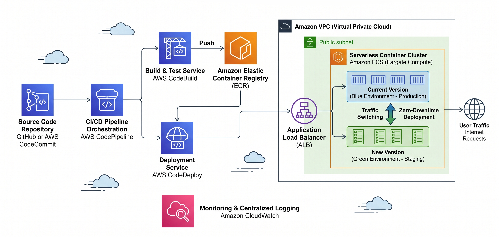

# Project 2: CI/CD Pipeline to Deploy on ECS Fargate

## 📋 Project Overview

| | |
|---|---|
| **Skill Level** | Intermediate |
| **Description** | In this project, you will build a fully automated CI/CD pipeline using AWS CodePipeline, CodeBuild, and CodeDeploy to containerize a Node.js application, push it to Amazon ECR, and deploy it to Amazon ECS Fargate with Blue/Green deployment strategy. |
| **AWS Services Used** | Amazon ECS (Fargate), Amazon ECR, AWS CodePipeline, AWS CodeBuild, AWS CodeDeploy, Application Load Balancer, Amazon VPC, IAM, CloudWatch |
| **Tools** | Docker, AWS CLI, Git |
| **Estimated Time** | 2–3 hours |

## 🏗️ Architecture Diagram



## 🎯 What You'll Learn

- Containerizing applications with Docker and multi-stage builds
- Storing container images in Amazon ECR
- Configuring ECS Fargate services and task definitions
- Building CI/CD pipelines with CodePipeline and CodeBuild
- Implementing Blue/Green deployments with CodeDeploy
- Setting up CloudWatch Logs for container monitoring

## 📁 Project Structure

```
ecs-fargate-cicd/
├── app/
│   ├── src/
│   │   └── index.js
│   ├── package.json
│   └── Dockerfile
├── infra/
│   ├── ecs-task-definition.json
│   ├── appspec.yaml
│   └── create-service.sh
├── buildspec.yml
└── README.md
```

---

## Steps to Complete the Project

### Step 1: Create the Node.js Application

Create `app/package.json`:

```json
{
  "name": "ecs-fargate-app",
  "version": "1.0.0",
  "description": "A containerized Node.js app deployed on ECS Fargate",
  "main": "src/index.js",
  "scripts": {
    "start": "node src/index.js"
  },
  "dependencies": {
    "express": "^4.18.2"
  }
}
```

Create `app/src/index.js`:

```javascript
const express = require('express');
const app = express();
const PORT = process.env.PORT || 3000;

app.get('/', (req, res) => {
  res.json({
    message: '🚀 Hello from ECS Fargate!',
    version: process.env.APP_VERSION || '1.0.0',
    timestamp: new Date().toISOString(),
    container_id: require('os').hostname(),
    environment: process.env.NODE_ENV || 'production'
  });
});

app.get('/health', (req, res) => {
  res.status(200).json({ status: 'healthy' });
});

app.listen(PORT, '0.0.0.0', () => {
  console.log(`Server running on port ${PORT}`);
});
```

### Step 2: Create the Dockerfile

Create `app/Dockerfile`:

```dockerfile
# Build stage
FROM node:18-alpine AS builder
WORKDIR /app
COPY package*.json ./
RUN npm ci --only=production

# Production stage
FROM node:18-alpine
WORKDIR /app

# Create non-root user
RUN addgroup -S appgroup && adduser -S appuser -G appgroup

COPY --from=builder /app/node_modules ./node_modules
COPY src/ ./src/
COPY package.json ./

USER appuser
EXPOSE 3000

HEALTHCHECK --interval=30s --timeout=3s --start-period=5s --retries=3 \
  CMD wget --no-verbose --tries=1 --spider http://localhost:3000/health || exit 1

CMD ["node", "src/index.js"]
```

### Step 3: Create an ECR Repository

```bash
# Create ECR repository
aws ecr create-repository \
  --repository-name ecs-fargate-app \
  --image-scanning-configuration scanOnPush=true \
  --region us-east-1

# Get the repository URI (save this for later)
ECR_URI=$(aws ecr describe-repositories \
  --repository-names ecs-fargate-app \
  --query 'repositories[0].repositoryUri' \
  --output text)
echo $ECR_URI
```

### Step 4: Build and Push the Docker Image (Initial)

```bash
# Authenticate Docker to ECR
aws ecr get-login-password --region us-east-1 | \
  docker login --username AWS --password-stdin $ECR_URI

# Build the image
cd app
docker build -t ecs-fargate-app .

# Tag and push
docker tag ecs-fargate-app:latest $ECR_URI:latest
docker push $ECR_URI:latest
```

### Step 5: Create the ECS Cluster and Networking

```bash
# Create ECS Cluster
aws ecs create-cluster --cluster-name fargate-cicd-cluster

# Create a VPC (or use default VPC)
# Note your VPC ID, Subnet IDs (at least 2 in different AZs), and create a Security Group

# Create Security Group for the ALB
aws ec2 create-security-group \
  --group-name fargate-alb-sg \
  --description "Security group for Fargate ALB" \
  --vpc-id <your-vpc-id>

aws ec2 authorize-security-group-ingress \
  --group-id <alb-sg-id> \
  --protocol tcp \
  --port 80 \
  --cidr 0.0.0.0/0

# Create Security Group for ECS Tasks
aws ec2 create-security-group \
  --group-name fargate-task-sg \
  --description "Security group for Fargate tasks" \
  --vpc-id <your-vpc-id>

aws ec2 authorize-security-group-ingress \
  --group-id <task-sg-id> \
  --protocol tcp \
  --port 3000 \
  --source-group <alb-sg-id>
```

### Step 6: Create the Application Load Balancer

```bash
# Create ALB
aws elbv2 create-load-balancer \
  --name fargate-cicd-alb \
  --subnets <subnet-1> <subnet-2> \
  --security-groups <alb-sg-id> \
  --scheme internet-facing \
  --type application

# Create Target Group (IP type for Fargate)
aws elbv2 create-target-group \
  --name fargate-cicd-tg-1 \
  --protocol HTTP \
  --port 3000 \
  --vpc-id <your-vpc-id> \
  --target-type ip \
  --health-check-path /health \
  --health-check-interval-seconds 30

# Create a second Target Group for Blue/Green deployment
aws elbv2 create-target-group \
  --name fargate-cicd-tg-2 \
  --protocol HTTP \
  --port 3000 \
  --vpc-id <your-vpc-id> \
  --target-type ip \
  --health-check-path /health \
  --health-check-interval-seconds 30

# Create Listener
aws elbv2 create-listener \
  --load-balancer-arn <alb-arn> \
  --protocol HTTP \
  --port 80 \
  --default-actions Type=forward,TargetGroupArn=<tg-1-arn>
```

### Step 7: Create the ECS Task Definition

Create `infra/ecs-task-definition.json`:

```json
{
  "family": "fargate-cicd-task",
  "networkMode": "awsvpc",
  "requiresCompatibilities": ["FARGATE"],
  "cpu": "256",
  "memory": "512",
  "executionRoleArn": "arn:aws:iam::<ACCOUNT_ID>:role/ecsTaskExecutionRole",
  "containerDefinitions": [
    {
      "name": "app",
      "image": "<ECR_URI>:latest",
      "portMappings": [
        {
          "containerPort": 3000,
          "protocol": "tcp"
        }
      ],
      "environment": [
        {
          "name": "NODE_ENV",
          "value": "production"
        },
        {
          "name": "APP_VERSION",
          "value": "1.0.0"
        }
      ],
      "logConfiguration": {
        "logDriver": "awslogs",
        "options": {
          "awslogs-group": "/ecs/fargate-cicd-app",
          "awslogs-region": "us-east-1",
          "awslogs-stream-prefix": "ecs"
        }
      },
      "healthCheck": {
        "command": ["CMD-SHELL", "wget --no-verbose --tries=1 --spider http://localhost:3000/health || exit 1"],
        "interval": 30,
        "timeout": 5,
        "retries": 3,
        "startPeriod": 10
      },
      "essential": true
    }
  ]
}
```

Register the task definition:

```bash
# Create CloudWatch Log Group
aws logs create-log-group --log-group-name /ecs/fargate-cicd-app

# Create ECS Task Execution Role (if not exists)
aws iam create-role \
  --role-name ecsTaskExecutionRole \
  --assume-role-policy-document '{
    "Version": "2012-10-17",
    "Statement": [{
      "Effect": "Allow",
      "Principal": {"Service": "ecs-tasks.amazonaws.com"},
      "Action": "sts:AssumeRole"
    }]
  }'

aws iam attach-role-policy \
  --role-name ecsTaskExecutionRole \
  --policy-arn arn:aws:iam::aws:policy/service-role/AmazonECSTaskExecutionRolePolicy

# Register task definition
aws ecs register-task-definition \
  --cli-input-json file://infra/ecs-task-definition.json
```

### Step 8: Create the ECS Service

```bash
aws ecs create-service \
  --cluster fargate-cicd-cluster \
  --service-name fargate-cicd-service \
  --task-definition fargate-cicd-task \
  --desired-count 2 \
  --launch-type FARGATE \
  --deployment-controller type=CODE_DEPLOY \
  --network-configuration "awsvpcConfiguration={subnets=[<subnet-1>,<subnet-2>],securityGroups=[<task-sg-id>],assignPublicIp=ENABLED}" \
  --load-balancers "targetGroupArn=<tg-1-arn>,containerName=app,containerPort=3000"
```

### Step 9: Create the CodeBuild Project

Create `buildspec.yml` (in the repository root):

```yaml
version: 0.2

phases:
  pre_build:
    commands:
      - echo Logging in to Amazon ECR...
      - aws ecr get-login-password --region $AWS_DEFAULT_REGION | docker login --username AWS --password-stdin $AWS_ACCOUNT_ID.dkr.ecr.$AWS_DEFAULT_REGION.amazonaws.com
      - REPOSITORY_URI=$AWS_ACCOUNT_ID.dkr.ecr.$AWS_DEFAULT_REGION.amazonaws.com/ecs-fargate-app
      - COMMIT_HASH=$(echo $CODEBUILD_RESOLVED_SOURCE_VERSION | cut -c 1-7)
      - IMAGE_TAG=${COMMIT_HASH:=latest}

  build:
    commands:
      - echo Building the Docker image...
      - cd app
      - docker build -t $REPOSITORY_URI:$IMAGE_TAG .
      - docker tag $REPOSITORY_URI:$IMAGE_TAG $REPOSITORY_URI:latest

  post_build:
    commands:
      - echo Pushing the Docker image...
      - docker push $REPOSITORY_URI:$IMAGE_TAG
      - docker push $REPOSITORY_URI:latest
      - echo Writing image definitions file...
      - cd ..
      - printf '{"ImageURI":"%s"}' $REPOSITORY_URI:$IMAGE_TAG > imageDetail.json
      - echo Creating appspec and taskdef files for CodeDeploy...
      - |
        cat <<EOF > taskdef.json
        {
          "family": "fargate-cicd-task",
          "networkMode": "awsvpc",
          "requiresCompatibilities": ["FARGATE"],
          "cpu": "256",
          "memory": "512",
          "executionRoleArn": "arn:aws:iam::${AWS_ACCOUNT_ID}:role/ecsTaskExecutionRole",
          "containerDefinitions": [{
            "name": "app",
            "image": "<IMAGE1_NAME>",
            "portMappings": [{"containerPort": 3000, "protocol": "tcp"}],
            "logConfiguration": {
              "logDriver": "awslogs",
              "options": {
                "awslogs-group": "/ecs/fargate-cicd-app",
                "awslogs-region": "${AWS_DEFAULT_REGION}",
                "awslogs-stream-prefix": "ecs"
              }
            },
            "essential": true
          }]
        }
        EOF

artifacts:
  files:
    - imageDetail.json
    - appspec.yaml
    - taskdef.json
```

### Step 10: Create the AppSpec File for CodeDeploy

Create `infra/appspec.yaml`:

```yaml
version: 0.0
Resources:
  - TargetService:
      Type: AWS::ECS::Service
      Properties:
        TaskDefinition: <TASK_DEFINITION>
        LoadBalancerInfo:
          ContainerName: "app"
          ContainerPort: 3000
```

### Step 11: Set Up CodePipeline

1. Go to the **AWS CodePipeline** console
2. Click **Create pipeline**
3. Configure the pipeline:

   **Pipeline settings:**
   - Pipeline name: `fargate-cicd-pipeline`
   - Service role: Create new role

   **Source stage:**
   - Source provider: **GitHub (Version 2)** or **CodeCommit**
   - Repository: Your repository
   - Branch: `main`
   - Detection: CloudWatch Events

   **Build stage:**
   - Build provider: **AWS CodeBuild**
   - Create a new build project:
     - Name: `fargate-cicd-build`
     - Environment: Managed image, Amazon Linux 2, Standard runtime
     - Privileged mode: **Enabled** (required for Docker builds)
     - Environment variables:
       - `AWS_ACCOUNT_ID` = your account ID
       - `AWS_DEFAULT_REGION` = `us-east-1`
   - Buildspec: Use the `buildspec.yml` in the source code

   **Deploy stage:**
   - Deploy provider: **Amazon ECS (Blue/Green)**
   - Cluster: `fargate-cicd-cluster`
   - Service: `fargate-cicd-service`
   - CodeDeploy application: Create new
   - Deployment group: Create new (select both target groups)

4. Click **Create pipeline**

### Step 12: Configure IAM Permissions for CodeBuild

Ensure the CodeBuild service role has these permissions:

```json
{
  "Version": "2012-10-17",
  "Statement": [
    {
      "Effect": "Allow",
      "Action": [
        "ecr:GetAuthorizationToken",
        "ecr:BatchCheckLayerAvailability",
        "ecr:GetDownloadUrlForLayer",
        "ecr:BatchGetImage",
        "ecr:PutImage",
        "ecr:InitiateLayerUpload",
        "ecr:UploadLayerPart",
        "ecr:CompleteLayerUpload"
      ],
      "Resource": "*"
    },
    {
      "Effect": "Allow",
      "Action": [
        "ecs:DescribeServices",
        "ecs:DescribeTaskDefinition",
        "ecs:RegisterTaskDefinition"
      ],
      "Resource": "*"
    }
  ]
}
```

### Step 13: Test the Pipeline

1. Make a code change in `app/src/index.js`:
   ```javascript
   message: '🚀 Hello from ECS Fargate - v2.0!',
   ```
2. Commit and push to your repository:
   ```bash
   git add .
   git commit -m "Update app to v2.0"
   git push origin main
   ```
3. Watch the pipeline execute in the **CodePipeline console**
4. Monitor the Blue/Green deployment in **CodeDeploy**
5. Verify the new version is live at `http://<alb-dns-name>`

### Step 14: Verify & Monitor

1. Check **CloudWatch Logs** at `/ecs/fargate-cicd-app` for container logs
2. View **ECS Service** metrics (CPU, Memory, Running Tasks)
3. Check **CodeDeploy** deployment history for rollback options

### Step 15: Clean Up Resources

```bash
# Delete ECS Service
aws ecs update-service --cluster fargate-cicd-cluster --service fargate-cicd-service --desired-count 0
aws ecs delete-service --cluster fargate-cicd-cluster --service fargate-cicd-service

# Delete ECS Cluster
aws ecs delete-cluster --cluster fargate-cicd-cluster

# Delete ECR Repository
aws ecr delete-repository --repository-name ecs-fargate-app --force

# Delete ALB, Target Groups, CodePipeline, and CodeBuild via console
# Delete CloudWatch Log Group
aws logs delete-log-group --log-group-name /ecs/fargate-cicd-app
```

---

## 🔑 Key Takeaways

- **Containerization**: Multi-stage Docker builds produce lean, secure production images
- **Serverless Compute**: Fargate eliminates server management while running containers at scale
- **CI/CD Automation**: CodePipeline orchestrates the entire build-test-deploy workflow
- **Blue/Green Deployments**: Zero-downtime deployments with instant rollback capability
- **Observability**: CloudWatch Logs provide centralized container logging

## 🚀 Bonus Challenges

- Add a test stage in CodePipeline that runs unit tests before building
- Implement container image scanning with ECR and fail the pipeline on critical vulnerabilities
- Add SNS notifications for pipeline failures
- Configure auto-scaling for the ECS service based on ALB request count
- Add a staging environment with manual approval before production deployment
