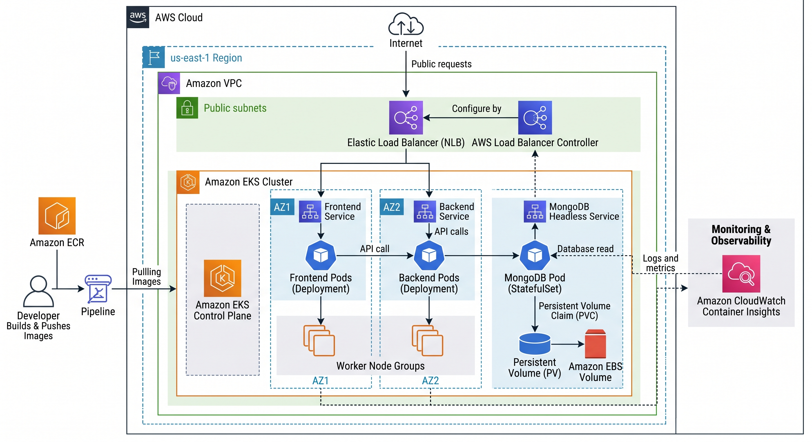

# Project 3: Deploy An Application with Kubernetes and EKS

## 📋 Project Overview

| | |
|---|---|
| **Skill Level** | Intermediate |
| **Description** | In this project, you will deploy a containerized microservices application on Amazon EKS (Elastic Kubernetes Service). You will create an EKS cluster, configure kubectl, deploy a multi-container application with a frontend and backend, set up Kubernetes services with a Load Balancer, and implement Horizontal Pod Autoscaler for automatic scaling. |
| **AWS Services Used** | Amazon EKS, Amazon ECR, Amazon VPC, Elastic Load Balancer, IAM, CloudWatch |
| **Tools** | kubectl, eksctl, Docker, AWS CLI, Helm |
| **Estimated Time** | 2–3 hours |

## 🏗️ Architecture Diagram



## 🎯 What You'll Learn

- Creating and managing EKS clusters with eksctl
- Writing Kubernetes manifests (Deployments, Services, ConfigMaps, Secrets)
- Container orchestration with Kubernetes
- Implementing Horizontal Pod Autoscaler (HPA)
- Exposing applications via AWS Load Balancer Controller
- Managing application configuration with ConfigMaps and Secrets
- Monitoring with CloudWatch Container Insights

## 📁 Project Structure

```
eks-kubernetes-app/
├── app/
│   ├── frontend/
│   │   ├── src/
│   │   ├── Dockerfile
│   │   └── package.json
│   └── backend/
│       ├── src/
│       ├── Dockerfile
│       └── package.json
├── k8s/
│   ├── namespace.yaml
│   ├── configmap.yaml
│   ├── secret.yaml
│   ├── backend-deployment.yaml
│   ├── backend-service.yaml
│   ├── frontend-deployment.yaml
│   ├── frontend-service.yaml
│   ├── mongodb-statefulset.yaml
│   ├── mongodb-service.yaml
│   └── hpa.yaml
├── cluster/
│   └── cluster-config.yaml
└── README.md
```

---

## Steps to Complete the Project

### Step 1: Prerequisites & Tool Installation

1. Install **AWS CLI** (v2):
   ```bash
   # Verify installation
   aws --version
   aws configure
   ```

2. Install **kubectl**:
   ```bash
   # macOS
   brew install kubectl

   # Linux
   curl -LO "https://dl.k8s.io/release/$(curl -L -s https://dl.k8s.io/release/stable.txt)/bin/linux/amd64/kubectl"
   chmod +x kubectl && sudo mv kubectl /usr/local/bin/

   # Verify
   kubectl version --client
   ```

3. Install **eksctl**:
   ```bash
   # macOS
   brew tap weaveworks/tap
   brew install weaveworks/tap/eksctl

   # Linux
   curl --silent --location "https://github.com/eksctl-io/eksctl/releases/latest/download/eksctl_$(uname -s)_amd64.tar.gz" | tar xz -C /tmp
   sudo mv /tmp/eksctl /usr/local/bin

   # Verify
   eksctl version
   ```

4. Install **Docker** and **Helm**:
   ```bash
   # Verify Docker
   docker --version

   # Install Helm
   brew install helm   # macOS
   # or
   curl https://raw.githubusercontent.com/helm/helm/main/scripts/get-helm-3 | bash
   ```

### Step 2: Create the EKS Cluster

Create `cluster/cluster-config.yaml`:

```yaml
apiVersion: eksctl.io/v1alpha5
kind: ClusterConfig

metadata:
  name: my-eks-cluster
  region: us-east-1
  version: "1.28"

managedNodeGroups:
  - name: worker-nodes
    instanceType: t3.medium
    desiredCapacity: 2
    minSize: 1
    maxSize: 4
    volumeSize: 30
    ssh:
      allow: false
    iam:
      withAddonPolicies:
        imageBuilder: true
        albIngress: true
        cloudWatch: true

cloudWatch:
  clusterLogging:
    enableTypes: ["api", "audit", "authenticator"]

iam:
  withOIDC: true
```

Create the cluster:

```bash
# Create the EKS cluster (takes ~15-20 minutes)
eksctl create cluster -f cluster/cluster-config.yaml

# Verify cluster is running
kubectl get nodes
kubectl cluster-info
```

### Step 3: Create ECR Repositories and Build Images

```bash
# Create ECR repositories
aws ecr create-repository --repository-name eks-app/frontend --region us-east-1
aws ecr create-repository --repository-name eks-app/backend --region us-east-1

# Get ECR login
aws ecr get-login-password --region us-east-1 | docker login --username AWS --password-stdin <ACCOUNT_ID>.dkr.ecr.us-east-1.amazonaws.com
```

**Backend Application** — Create `app/backend/src/server.js`:

```javascript
const express = require('express');
const mongoose = require('mongoose');
const cors = require('cors');

const app = express();
app.use(cors());
app.use(express.json());

// MongoDB connection
const MONGO_URI = process.env.MONGO_URI || 'mongodb://mongodb-service:27017/myapp';
mongoose.connect(MONGO_URI)
  .then(() => console.log('Connected to MongoDB'))
  .catch(err => console.error('MongoDB connection error:', err));

// Schema
const ItemSchema = new mongoose.Schema({
  name: String,
  description: String,
  createdAt: { type: Date, default: Date.now }
});
const Item = mongoose.model('Item', ItemSchema);

// Routes
app.get('/api/health', (req, res) => {
  res.json({ status: 'healthy', pod: process.env.HOSTNAME });
});

app.get('/api/items', async (req, res) => {
  const items = await Item.find().sort({ createdAt: -1 });
  res.json(items);
});

app.post('/api/items', async (req, res) => {
  const item = new Item(req.body);
  await item.save();
  res.status(201).json(item);
});

app.delete('/api/items/:id', async (req, res) => {
  await Item.findByIdAndDelete(req.params.id);
  res.json({ message: 'Item deleted' });
});

const PORT = process.env.PORT || 5000;
app.listen(PORT, () => console.log(`Backend running on port ${PORT}`));
```

Create `app/backend/package.json`:

```json
{
  "name": "eks-backend",
  "version": "1.0.0",
  "main": "src/server.js",
  "scripts": { "start": "node src/server.js" },
  "dependencies": {
    "express": "^4.18.2",
    "mongoose": "^7.6.0",
    "cors": "^2.8.5"
  }
}
```

Create `app/backend/Dockerfile`:

```dockerfile
FROM node:18-alpine
WORKDIR /app
COPY package*.json ./
RUN npm ci --only=production
COPY src/ ./src/
RUN addgroup -S appgroup && adduser -S appuser -G appgroup
USER appuser
EXPOSE 5000
CMD ["node", "src/server.js"]
```

**Frontend Application** — Create `app/frontend/src/index.html`:

```html
<!DOCTYPE html>
<html lang="en">
<head>
  <meta charset="UTF-8">
  <meta name="viewport" content="width=device-width, initial-scale=1.0">
  <title>EKS Kubernetes App</title>
  <link href="https://cdn.jsdelivr.net/npm/bootstrap@5.3.0/dist/css/bootstrap.min.css" rel="stylesheet">
</head>
<body class="bg-light">
  <div class="container mt-5">
    <h1 class="text-center mb-4">🚀 Kubernetes on EKS</h1>
    <div class="card mb-4">
      <div class="card-body">
        <h3>Add Item</h3>
        <input type="text" id="name" class="form-control mb-2" placeholder="Item Name">
        <input type="text" id="description" class="form-control mb-2" placeholder="Description">
        <button class="btn btn-primary" onclick="addItem()">Add</button>
      </div>
    </div>
    <div class="card">
      <div class="card-body">
        <h3>Items</h3>
        <ul id="items" class="list-group"></ul>
      </div>
    </div>
    <div class="card mt-3">
      <div class="card-body">
        <h3>Health Check</h3>
        <button class="btn btn-success" onclick="checkHealth()">Check Backend</button>
        <pre id="health" class="mt-2"></pre>
      </div>
    </div>
  </div>
  <script>
    const API = '/api';

    async function loadItems() {
      const res = await fetch(`${API}/items`);
      const items = await res.json();
      document.getElementById('items').innerHTML = items.map(i =>
        `<li class="list-group-item d-flex justify-content-between">
          <span><strong>${i.name}</strong>: ${i.description}</span>
          <button class="btn btn-sm btn-danger" onclick="deleteItem('${i._id}')">Delete</button>
        </li>`
      ).join('');
    }

    async function addItem() {
      const name = document.getElementById('name').value;
      const description = document.getElementById('description').value;
      await fetch(`${API}/items`, {
        method: 'POST',
        headers: { 'Content-Type': 'application/json' },
        body: JSON.stringify({ name, description })
      });
      document.getElementById('name').value = '';
      document.getElementById('description').value = '';
      loadItems();
    }

    async function deleteItem(id) {
      await fetch(`${API}/items/${id}`, { method: 'DELETE' });
      loadItems();
    }

    async function checkHealth() {
      const res = await fetch(`${API}/health`);
      const data = await res.json();
      document.getElementById('health').textContent = JSON.stringify(data, null, 2);
    }

    loadItems();
  </script>
</body>
</html>
```

Create `app/frontend/Dockerfile`:

```dockerfile
FROM nginx:alpine
COPY src/ /usr/share/nginx/html/
COPY nginx.conf /etc/nginx/conf.d/default.conf
EXPOSE 80
CMD ["nginx", "-g", "daemon off;"]
```

Create `app/frontend/nginx.conf`:

```nginx
server {
    listen 80;
    server_name _;

    location / {
        root /usr/share/nginx/html;
        index index.html;
        try_files $uri $uri/ /index.html;
    }

    location /api/ {
        proxy_pass http://backend-service:5000;
        proxy_set_header Host $host;
        proxy_set_header X-Real-IP $remote_addr;
    }
}
```

Build and push images:

```bash
# Build and push backend
cd app/backend
docker build -t <ACCOUNT_ID>.dkr.ecr.us-east-1.amazonaws.com/eks-app/backend:latest .
docker push <ACCOUNT_ID>.dkr.ecr.us-east-1.amazonaws.com/eks-app/backend:latest

# Build and push frontend
cd ../frontend
docker build -t <ACCOUNT_ID>.dkr.ecr.us-east-1.amazonaws.com/eks-app/frontend:latest .
docker push <ACCOUNT_ID>.dkr.ecr.us-east-1.amazonaws.com/eks-app/frontend:latest
```

### Step 4: Create Kubernetes Namespace and Configuration

Create `k8s/namespace.yaml`:

```yaml
apiVersion: v1
kind: Namespace
metadata:
  name: my-app
  labels:
    app: my-app
```

Create `k8s/configmap.yaml`:

```yaml
apiVersion: v1
kind: ConfigMap
metadata:
  name: app-config
  namespace: my-app
data:
  MONGO_URI: "mongodb://mongodb-service:27017/myapp"
  NODE_ENV: "production"
  PORT: "5000"
```

Create `k8s/secret.yaml`:

```yaml
apiVersion: v1
kind: Secret
metadata:
  name: app-secrets
  namespace: my-app
type: Opaque
data:
  # Base64 encoded values (echo -n "value" | base64)
  MONGO_INITDB_ROOT_USERNAME: YWRtaW4=          # admin
  MONGO_INITDB_ROOT_PASSWORD: cGFzc3dvcmQxMjM=  # password123
```

Apply:

```bash
kubectl apply -f k8s/namespace.yaml
kubectl apply -f k8s/configmap.yaml
kubectl apply -f k8s/secret.yaml
```

### Step 5: Deploy MongoDB with StatefulSet

Create `k8s/mongodb-statefulset.yaml`:

```yaml
apiVersion: apps/v1
kind: StatefulSet
metadata:
  name: mongodb
  namespace: my-app
spec:
  serviceName: "mongodb-service"
  replicas: 1
  selector:
    matchLabels:
      app: mongodb
  template:
    metadata:
      labels:
        app: mongodb
    spec:
      containers:
        - name: mongodb
          image: mongo:6.0
          ports:
            - containerPort: 27017
          env:
            - name: MONGO_INITDB_ROOT_USERNAME
              valueFrom:
                secretKeyRef:
                  name: app-secrets
                  key: MONGO_INITDB_ROOT_USERNAME
            - name: MONGO_INITDB_ROOT_PASSWORD
              valueFrom:
                secretKeyRef:
                  name: app-secrets
                  key: MONGO_INITDB_ROOT_PASSWORD
          volumeMounts:
            - name: mongo-storage
              mountPath: /data/db
          resources:
            requests:
              memory: "256Mi"
              cpu: "250m"
            limits:
              memory: "512Mi"
              cpu: "500m"
  volumeClaimTemplates:
    - metadata:
        name: mongo-storage
      spec:
        accessModes: ["ReadWriteOnce"]
        resources:
          requests:
            storage: 10Gi
```

Create `k8s/mongodb-service.yaml`:

```yaml
apiVersion: v1
kind: Service
metadata:
  name: mongodb-service
  namespace: my-app
spec:
  selector:
    app: mongodb
  ports:
    - port: 27017
      targetPort: 27017
  clusterIP: None  # Headless service for StatefulSet
```

### Step 6: Deploy the Backend

Create `k8s/backend-deployment.yaml`:

```yaml
apiVersion: apps/v1
kind: Deployment
metadata:
  name: backend
  namespace: my-app
  labels:
    app: backend
spec:
  replicas: 3
  selector:
    matchLabels:
      app: backend
  template:
    metadata:
      labels:
        app: backend
    spec:
      containers:
        - name: backend
          image: <ACCOUNT_ID>.dkr.ecr.us-east-1.amazonaws.com/eks-app/backend:latest
          ports:
            - containerPort: 5000
          envFrom:
            - configMapRef:
                name: app-config
          resources:
            requests:
              memory: "128Mi"
              cpu: "100m"
            limits:
              memory: "256Mi"
              cpu: "500m"
          readinessProbe:
            httpGet:
              path: /api/health
              port: 5000
            initialDelaySeconds: 10
            periodSeconds: 5
          livenessProbe:
            httpGet:
              path: /api/health
              port: 5000
            initialDelaySeconds: 15
            periodSeconds: 10
```

Create `k8s/backend-service.yaml`:

```yaml
apiVersion: v1
kind: Service
metadata:
  name: backend-service
  namespace: my-app
spec:
  selector:
    app: backend
  ports:
    - port: 5000
      targetPort: 5000
  type: ClusterIP
```

### Step 7: Deploy the Frontend

Create `k8s/frontend-deployment.yaml`:

```yaml
apiVersion: apps/v1
kind: Deployment
metadata:
  name: frontend
  namespace: my-app
  labels:
    app: frontend
spec:
  replicas: 2
  selector:
    matchLabels:
      app: frontend
  template:
    metadata:
      labels:
        app: frontend
    spec:
      containers:
        - name: frontend
          image: <ACCOUNT_ID>.dkr.ecr.us-east-1.amazonaws.com/eks-app/frontend:latest
          ports:
            - containerPort: 80
          resources:
            requests:
              memory: "64Mi"
              cpu: "50m"
            limits:
              memory: "128Mi"
              cpu: "200m"
          readinessProbe:
            httpGet:
              path: /
              port: 80
            initialDelaySeconds: 5
            periodSeconds: 5
```

Create `k8s/frontend-service.yaml`:

```yaml
apiVersion: v1
kind: Service
metadata:
  name: frontend-service
  namespace: my-app
  annotations:
    service.beta.kubernetes.io/aws-load-balancer-type: "nlb"
    service.beta.kubernetes.io/aws-load-balancer-scheme: "internet-facing"
spec:
  type: LoadBalancer
  selector:
    app: frontend
  ports:
    - port: 80
      targetPort: 80
      protocol: TCP
```

### Step 8: Deploy All Resources

```bash
# Deploy in order
kubectl apply -f k8s/mongodb-statefulset.yaml
kubectl apply -f k8s/mongodb-service.yaml

# Wait for MongoDB to be ready
kubectl wait --for=condition=ready pod -l app=mongodb -n my-app --timeout=120s

kubectl apply -f k8s/backend-deployment.yaml
kubectl apply -f k8s/backend-service.yaml
kubectl apply -f k8s/frontend-deployment.yaml
kubectl apply -f k8s/frontend-service.yaml

# Verify all pods are running
kubectl get all -n my-app
```

### Step 9: Configure Horizontal Pod Autoscaler

Install Metrics Server (required for HPA):

```bash
kubectl apply -f https://github.com/kubernetes-sigs/metrics-server/releases/latest/download/components.yaml
```

Create `k8s/hpa.yaml`:

```yaml
apiVersion: autoscaling/v2
kind: HorizontalPodAutoscaler
metadata:
  name: backend-hpa
  namespace: my-app
spec:
  scaleTargetRef:
    apiVersion: apps/v1
    kind: Deployment
    name: backend
  minReplicas: 2
  maxReplicas: 10
  metrics:
    - type: Resource
      resource:
        name: cpu
        target:
          type: Utilization
          averageUtilization: 60
    - type: Resource
      resource:
        name: memory
        target:
          type: Utilization
          averageUtilization: 70
---
apiVersion: autoscaling/v2
kind: HorizontalPodAutoscaler
metadata:
  name: frontend-hpa
  namespace: my-app
spec:
  scaleTargetRef:
    apiVersion: apps/v1
    kind: Deployment
    name: frontend
  minReplicas: 2
  maxReplicas: 6
  metrics:
    - type: Resource
      resource:
        name: cpu
        target:
          type: Utilization
          averageUtilization: 70
```

Apply HPA:

```bash
kubectl apply -f k8s/hpa.yaml
kubectl get hpa -n my-app
```

### Step 10: Verify the Deployment

```bash
# Get the Load Balancer URL
kubectl get svc frontend-service -n my-app
# Look for the EXTERNAL-IP column

# Check pod status
kubectl get pods -n my-app -o wide

# Check logs
kubectl logs -l app=backend -n my-app --tail=50

# Describe a pod (for troubleshooting)
kubectl describe pod -l app=backend -n my-app

# Test backend health
kubectl port-forward svc/backend-service 5000:5000 -n my-app &
curl http://localhost:5000/api/health
```

Open your browser and navigate to the Load Balancer URL. You should see the frontend application connected to the backend.

### Step 11: Load Testing (Optional - Test HPA)

```bash
# Run a simple load test
kubectl run load-generator --image=busybox -n my-app -- /bin/sh -c "while true; do wget -q -O- http://backend-service:5000/api/health; done"

# Watch HPA scale up
kubectl get hpa -n my-app --watch

# Clean up load test
kubectl delete pod load-generator -n my-app
```

### Step 12: Clean Up Resources

```bash
# Delete all Kubernetes resources
kubectl delete namespace my-app

# Delete the EKS cluster
eksctl delete cluster --name my-eks-cluster --region us-east-1

# Delete ECR repositories
aws ecr delete-repository --repository-name eks-app/frontend --force
aws ecr delete-repository --repository-name eks-app/backend --force
```

---

## 🔑 Key Takeaways

- **Container Orchestration**: Kubernetes automates deployment, scaling, and management of containerized applications
- **Managed Kubernetes**: EKS handles the control plane, so you focus on workloads
- **Declarative Configuration**: YAML manifests define desired state; Kubernetes ensures reality matches
- **Auto-Scaling**: HPA automatically adjusts pod count based on resource metrics
- **Service Discovery**: Kubernetes Services provide stable networking between pods
- **Persistent Storage**: StatefulSets with PersistentVolumeClaims ensure data durability for databases

## 🚀 Bonus Challenges

- Install AWS Load Balancer Controller and use Ingress resources instead of LoadBalancer services
- Add a Helm chart to package the entire application for easy deployment
- Implement Kubernetes RBAC (Role-Based Access Control) for team access
- Set up GitOps with ArgoCD or Flux for automated deployments from Git
- Add Prometheus and Grafana for advanced monitoring and dashboards
- Implement NetworkPolicies to restrict pod-to-pod communication
